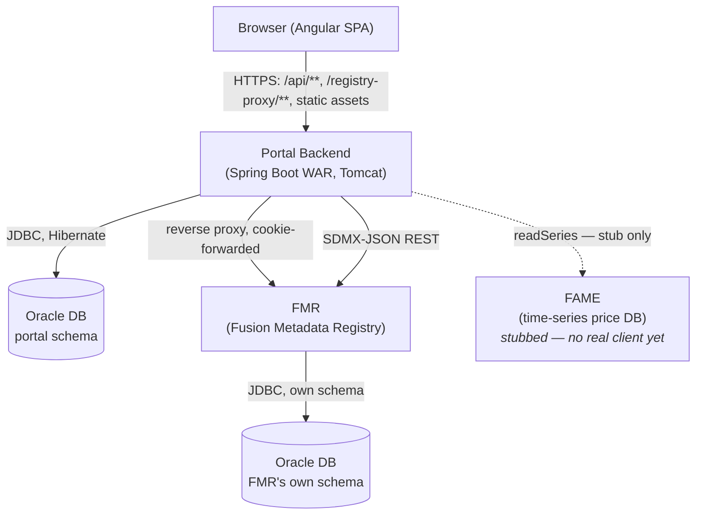
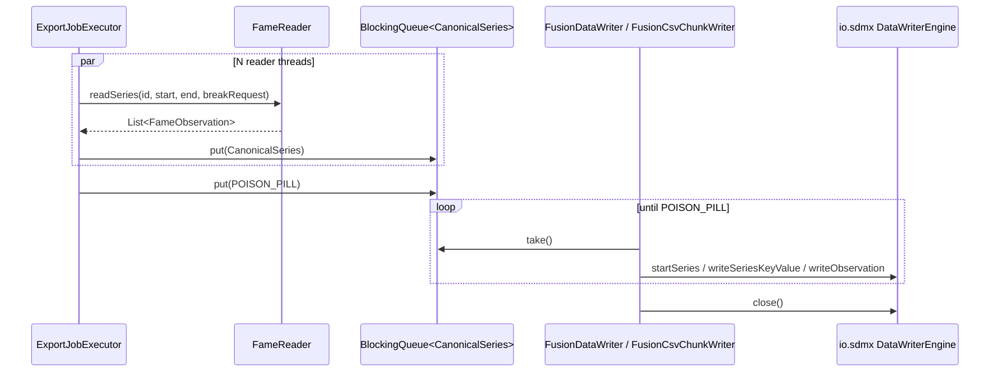
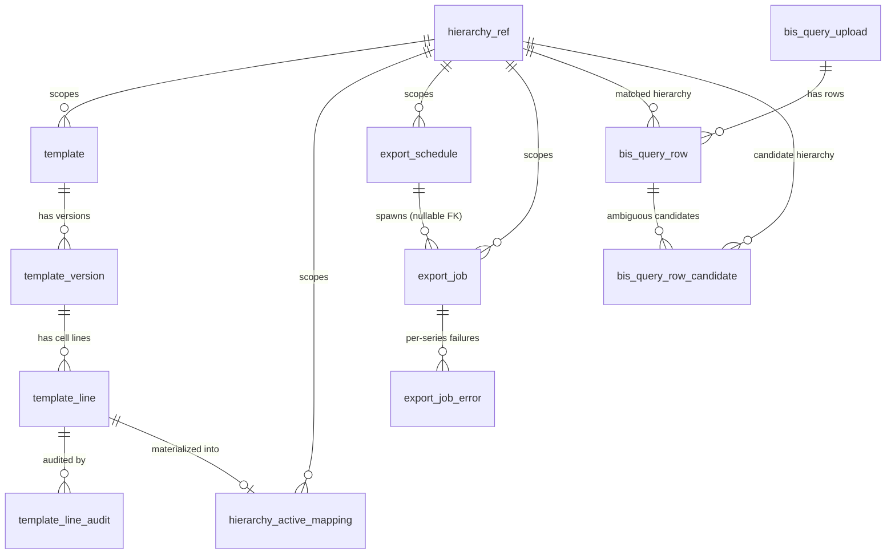
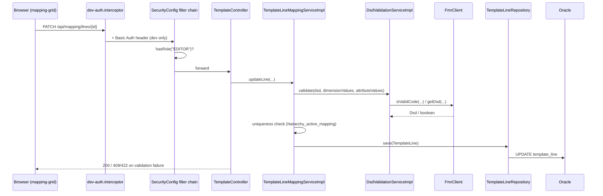
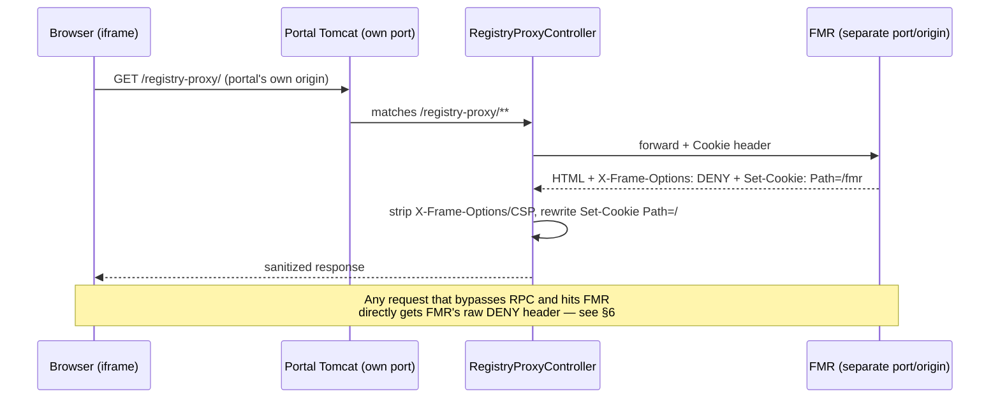
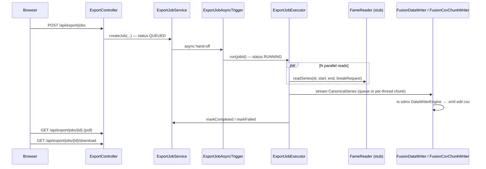
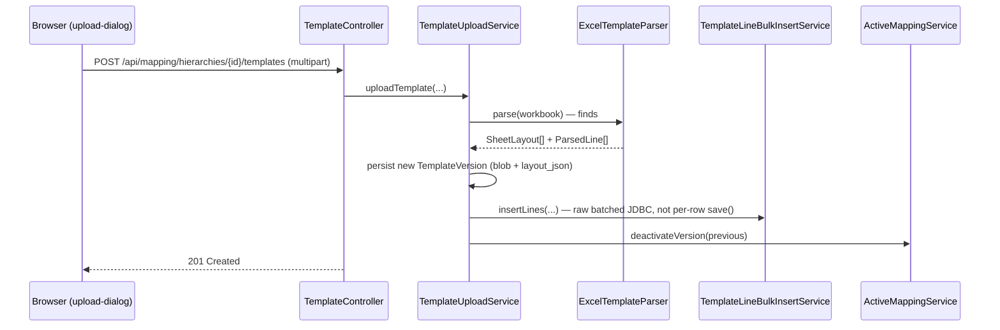
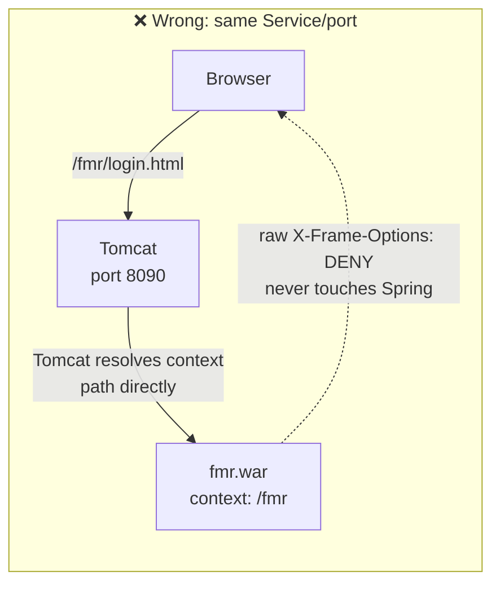
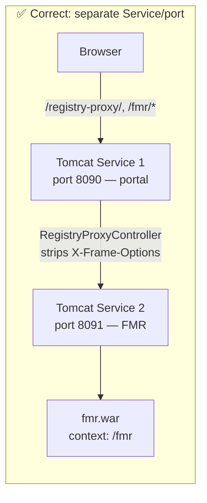

# SDMX Data Portal — Technical Architecture

This document describes the system architecture of the SDMX Data Portal: component
responsibilities, class-level communication flows, and the libraries/frameworks each
part is built on. It reflects the codebase as implemented, not just the original spec
(`sdmx-portal-3tab-implementation-spec_1.md`) — where the two differ, this document
follows the code and calls out the discrepancy.

## 1. System Overview

The portal is a 4-tab Angular SPA backed by one Spring Boot WAR, with two external
systems it depends on: **FMR** (BIS's Fusion Metadata Registry, a third-party WAR) for
SDMX structural metadata, and **FAME** (a time-series price database) for observation
data. FAME has no real integration yet — a stub generates synthetic data so the rest of
the pipeline can be built and tested end-to-end ahead of a real FAME client.

| Tab | Name | Purpose |
|---|---|---|
| 1 | Template Data Mapping | Upload an Excel template, map its cells to SDMX codes/series, version and audit every change |
| 2 | Registry | Reverse-proxied FMR UI, embedded via iframe — no custom UI of the portal's own |
| 3 | Export | Async, multithreaded export of mapped series to SDMX-ML / SDMX-CSV / SDMX-EDI (GESMES), one-off or scheduled |
| 4 | BIS Query Support | Upload a workbook of BIS-style codes, resolve each against the mapped hierarchies, fetch/export matched data |



## 2. Backend

**Stack:** Java 17, Spring Boot 3.2.5, packaged as a WAR (`spring-boot-starter-tomcat`
is `provided` scope — the app deploys to an external Tomcat, it doesn't embed one).
Root class `com.bis.sdmxportal.SdmxPortalApplication` extends
`SpringBootServletInitializer`, making the same artifact runnable both as `mvn
spring-boot:run` locally and as a WAR under Tomcat.

### 2.1 Package map

```
com.bis.sdmxportal
├── security/    SecurityConfig — the one Spring Security filter chain
├── web/         SpaForwardController — Angular deep-link fallback
├── registry/    Tab 2: FMR reverse proxy + SSO placeholder
│   ├── config/    RegistryProxyController, RegistrySsoPlaceholderConfig
│   └── controller/  RegistryLinkController (FMR deep-link URL builder)
├── mapping/     Tab 1: template upload, mapping grid, versioning, audit
├── export/      Tab 3: async export jobs, scheduling, SDMX writers
├── bisquery/    Tab 4: workbook upload, resolution, data fetch/export
├── fmr/         FMR HTTP client + internal structural-metadata model
│   ├── client/       FmrClient (interface), FmrRestClient, FmrStubClient
│   ├── client/sdmxjson/  wire-format DTOs (FMR's SDMX-JSON envelope)
│   └── model/        internal model (Dsd, Codelist, Hierarchy, …)
├── fame/        FameReader (interface) + FameStubReader — no real client yet
└── common/      cross-cutting: caching, exception handling, JSON converters
```

Each of `mapping`, `export`, `bisquery` follows the same internal shape:
`controller/ → service/ → entity/ + repository/`. Repositories are plain Spring Data
JPA interfaces (`extends JpaRepository<Entity, Long>`) — none are hand-written, and
none carry an explicit `@Repository` annotation (Spring Data proxies them
automatically). No entity uses JPA object-graph relationships (`@ManyToOne` etc.) —
every foreign key is a plain `Long` column, and joins are done explicitly in
repository query methods or service code.

### 2.2 Library choices and why

| Library | Used for | Why this one |
|---|---|---|
| `spring-boot-starter-web` | REST controllers, Spring MVC | Standard |
| `spring-boot-starter-data-jpa` | Hibernate + Spring Data repositories | Standard |
| `spring-boot-starter-security` | The one filter chain (`SecurityConfig`) | Standard |
| `spring-boot-starter-cache` + `caffeine` | `@Cacheable` FMR reads (`CacheConfig`) | FMR hierarchy/DSD/codelist trees are read constantly but change rarely — 5–10 min TTL avoids hammering FMR on every page load |
| `org.apache.httpcomponents.client5:httpclient5` | Backs Spring's `RestClient` (FMR calls, registry proxy) | The JDK's own `java.net.http.HttpClient` uses an NIO `Selector` that needs a loopback AF_UNIX socket pair — this fails outright on some locked-down Windows/container environments (see §7). Apache HttpClient5 doesn't have that dependency, so it's forced explicitly rather than relying on Spring Boot's auto-detection picking whichever HTTP client happens to be on the classpath. |
| `com.oracle.database.jdbc:ojdbc11` | Oracle JDBC driver | Production DB |
| `com.h2database:h2` (runtime) | In-memory DB for the `stub` dev profile | Lets the whole app run with zero external dependencies for local dev |
| `org.apache.poi` / `poi-ooxml` 5.2.5 | Read/write `.xlsx` | Template upload parsing (Tab 1), workbook export (Tab 1, Tab 4) |
| `io.sdmx:fusion-sdmx-im/-ml/-csv/-edi` 2.5.3 | SDMX-ML / SDMX-CSV / SDMX-EDI(GESMES) writers | BIS's own official Fusion SDMX library — same org that publishes FMR. Replaces earlier hand-rolled StAX/CSV/EDIFACT writers with a real, schema-conformant implementation (see §2.5). |
| `jackson-databind` | JSON (de)serialization | `layout_json`, `dimension_values`/`attribute_values` JSON columns; FMR's SDMX-JSON wire format |
| `springdoc-openapi-starter-webmvc-ui` 2.5.0 | Swagger UI / OpenAPI docs | `/swagger-ui/**`, `/v3/api-docs/**` |

### 2.3 Security (`security/SecurityConfig.java`)

One `SecurityFilterChain` bean governs the whole app. Auth is currently a **placeholder**:
an in-memory `InMemoryUserDetailsManager` with two BCrypt-encoded users —
`reviewer`/`reviewer` (role `REVIEWER`, read-only) and `editor`/`editor` (roles
`REVIEWER`+`EDITOR`, read-write) — authenticated via HTTP Basic. Real SSO against FMR's
own LDAP/AD is explicitly deferred; see `RegistrySsoPlaceholderConfig` and §6.

Key rules, in the order they're evaluated:

1. **Permit-all, no auth**: `/swagger-ui/**`, `/v3/api-docs/**`, `/actuator/health`,
   `/registry-proxy/**`, `/fmr/**` (FMR carries its own session — gating these behind
   the portal's Basic Auth would just break the iframe embed with no benefit).
2. **Permit-all, SPA shell**: `/`, `/index.html`, `/favicon.ico`, `/assets/**`,
   `/*.js`, `/*.css`, `/*.ico`, plus a regex GET matcher that permits any client-side
   route deep-link (e.g. `/mapping/123` on a browser refresh) as long as it isn't one
   of the reserved API/proxy/docs prefixes — these get forwarded to `index.html` by
   `SpaForwardController` so Angular's router can take over.
3. **`hasRole("EDITOR")`**: every state-changing mapping/export endpoint — line edits,
   bulk edits, skip, template upload/version-activate/delete/restore, export job
   creation, schedule create/update/delete.
4. **`hasRole("REVIEWER")`**: baseline for everything else under `/api/**`.
5. **`.anyRequest().authenticated()`**: catch-all.

`X-Frame-Options` is disabled globally (`headers.frameOptions(frame -> frame.disable())`)
because Tab 2 embeds FMR in an iframe — the app is never served to third-party origins,
so the clickjacking protection this header provides isn't needed here. CSRF is disabled
entirely (stateless API, no cookie-based session to protect).

### 2.4 Tab 2 — Registry proxy (`registry/config/RegistryProxyController.java`)

Tab 2 has no UI of its own — `RegistryEmbedComponent` on the frontend just renders an
`<iframe>` pointed at this proxy, and `RegistryProxyController` forwards everything to
a real FMR instance. It's a hand-rolled `RestClient`-based proxy, not Spring Cloud
Gateway — an earlier attempt with `spring-cloud-starter-gateway-mvc` never actually
dispatched (confirmed via bytecode inspection and genuine Tomcat-level 404s), so a
single `@RestController` with two catch-all mappings replaced it:

- `@RequestMapping("/registry-proxy/**")` → proxies through FMR's full context path
  (`fmr.base-url`, e.g. `http://fmr:8081/fmr`). Deliberately *not* `/registry/**` —
  that collides with the Angular app's own `/registry` route.
- `@RequestMapping("/fmr/**")` → proxies to just `fmr.base-url`'s scheme+host+port,
  because FMR's own HTML/JS emits root-relative asset URLs like `/fmr/assets/...` that
  the browser resolves against the portal's origin, not `/registry-proxy`.

Both share one `proxy(...)` method that:
- Forwards the browser's `Cookie` header to FMR (FMR is `JSESSIONID`-stateful) and
  rewrites FMR's `Set-Cookie: Path=/fmr` to `Path=/` on the way back, so one cookie
  covers both proxy mappings.
- Strips `Transfer-Encoding`, `Content-Security-Policy`, and **`X-Frame-Options`** from
  FMR's raw response — FMR sends `X-Frame-Options: DENY` by default, which would block
  the iframe regardless of the portal's own header config.

This header-stripping only works if every `/fmr/**` request actually reaches this
controller — see §6 for why FMR must run on a genuinely separate port/origin for that
to hold.

### 2.5 Tab 3 — Export pipeline

**Threading model** (`export/service/ExportJobExecutor.java`,
`ExportThreadPoolConfig.java`): two executor beans — a fixed-size `fameReadPool` (sized
from `export.fame-read-pool-size`, matching FAME's own connection limit rather than CPU
count — oversubscribing FAME concurrency causes contention, not speedup) for parallel,
I/O-bound reads, and a single-thread `writerExecutor`, because io.sdmx's
`DataWriterEngine` is not thread-safe for concurrent series writes.

- **SDMX-ML / SDMX-EDI**: N reader threads call `FameReader.readSeries(...)` in
  parallel and push completed `CanonicalSeries` onto a bounded
  `LinkedBlockingQueue`; one writer thread drains it via `FusionDataWriter`. A
  `POISON_PILL` sentinel signals completion.
- **SDMX-CSV**: skips the shared-writer bottleneck entirely — each reader thread owns
  its own `FusionCsvChunkWriter.ChunkHandle` (one output file per thread), since CSV
  has no document-level well-formedness constraint the way XML does. Chunks are
  concatenated into the final file afterward, keeping only the first header line.

**Failure handling**: a single series' FAME read failure is caught and recorded to
`export_job_error` without failing the whole job (ends `COMPLETED_WITH_ERRORS`). 20
*consecutive* failures are instead treated as FAME being systemically unreachable and
fail the job outright, rather than accumulating one error row per remaining series.

**io.sdmx usage** (`FusionDataWriter.java`, `FusionCsvChunkWriter.java`,
`ExportDataStructure.java`, `ExportDataflow.java`):



The portal's own DSD (`ExportDataStructure`) and dataflow (`ExportDataflow`) are
deliberately minimal — this app's export model is a flat `hierarchy_active_mapping`
row (one `sdmx_code` + one `fame_series_id`), not a real multi-dimension BIS DSD, so
the DSD has just one series-key dimension plus the mandatory time dimension and
`OBS_VALUE` measure. `OBS_STATUS`/`OBS_CONF`/`PRE_BREAK_VALUE` are observation-attached
attributes, present on every export regardless of format.

SDMX-CSV uses a genuinely different io.sdmx interface
(`ISeriesObsDataWriterEngine`/`Keyable`/`Observation` objects) than SDMX-ML/EDI's
shared `DataWriterEngine` (id/value streaming) — kept as its own writer class rather
than forced into one abstraction. SDMX-EDI has its own quirks: `EDIDataWriterEngineImpl`
needs the sender/receiver `HeaderBean` set *before* `startDataset` (else it defaults to
placeholder `"ZZZ"`), and is a deferred-flush writer — attribute values for a given
observation must be written *after* that observation's own `writeObservation` call,
since they're buffered for the *next* flush.

### 2.6 FMR client (`fmr/client/FmrClient.java`, `FmrRestClient.java`)

`FmrClient` is the interface the rest of the app depends on:
`listHierarchies`/`getHierarchy`/`getDsd`/`getCodelist`/`isValidCode`. Two
implementations, selected by Spring profile:

- `FmrRestClient` (`@Profile("!stub & !fmr-stub")`) — the real client, calling
  `GET {fmr.base-url}/ws/public/sdmxapi/rest/{artefactType}/{agencyId}/{resourceId}/{version}`
  with `Accept: application/vnd.sdmx.structure+json;version=2.0.0`. **Note:** this is
  FMR's *legacy* structural-metadata path — the newer SDMX REST v2 path
  (`/sdmx/v2/structure/...`) documented on fmrwiki.sdmx.io 404s against the actual FMR
  12.2.0 build this was verified against. `fmr/README.md` still documents the v2 path;
  that's stale and should be reconciled against this class's own code comment.
- `FmrStubClient` (`@Profile("stub | fmr-stub")`) — an in-memory fake seeded with
  sample hierarchies/DSD/codelists, for running the whole app without a live FMR.

Every artefact type is wrapped in one `{ "data": { "<pluralType>": [...] } }` envelope
(`SdmxJsonStructureMessage`) — `SdmxJsonMapper` translates this wire shape into the
app's internal, FMR-independent model (`fmr/model/*`: `Dsd`, `Codelist`, `Hierarchy`,
…). Dimensions/attributes reference their codelist/concept only by URN
(`urn:sdmx:...`), parsed by `SdmxUrn`; hierarchy nodes reference a `Code` URN rather
than an inline label, resolved via a cached `getCodelist` follow-up call.
Hierarchy/DSD/codelist reads are `@Cacheable` (Caffeine, 5–10 min TTL) since Tab 1
loads the tree once per session, not per keystroke.

`getDsd` tries resolving the given id as a **dataflow** first (users think in terms of
dataflows, not the DSD a dataflow happens to reference), falling back to treating it as
a literal DSD id if no matching dataflow exists.

### 2.7 FAME integration point (`fame/FameReader.java`)

The interface is a deliberately clean seam for a real FAME client — **no real
implementation exists yet**, only `FameStubReader`, which generates synthetic monthly
observations (constant value `"10"`, or `"5"` pre-break) so the export and BIS-query
pipelines can be built and tested without a live FAME connection.

```java
interface FameReader {
    List<FameObservation> readSeries(String seriesId, String start, String end);
    default List<FameObservation> readSeries(String seriesId, String start, String end,
                                              BreakRequest breakRequest) {
        return readSeries(seriesId, start, end); // overridden only if break support is added
    }
}
```

`BreakRequest` models two break-in-series types: `STRUCTURAL` (FAME resolves both
pre/post values itself for the same series id) and `HIERARCHY` (needs `asOfDate` — FAME
computes the pre-break value against the hierarchy as it existed on that date).

### 2.8 Database schema

12 tables, no ORM-level relationships (`@ManyToOne` etc.) — every FK is a plain `Long`
column, joined explicitly in application code. Tab 2 has no schema of its own (uses
FMR's separate database/schema entirely).



**Note on schema drift**: `docker/oracle-init/02_portal_schema.sql` (used only by the
local Docker Compose Oracle init) is a stale copy of the canonical `db/schema.sql` — it
is missing the `export_schedule` table entirely, several `export_job`/`template_line`
columns, and some audit change types. The deployable bundle (`deploy/oracle/`) uses the
canonical `db/schema.sql`; only the Docker Compose dev path is affected. Worth
reconciling as a follow-up.

## 3. Frontend

**Stack:** Angular 22 (standalone components, no `NgModule`s), Angular Material 22,
AG Grid Community 36 (mapping grid, Tab 4 row tables), RxJS 7.8, TypeScript 6.0. Test
runner is Vitest, not Karma/Jasmine.

### 3.1 Structure

```
src/app
├── core/
│   ├── interceptors/   dev-auth (adds Basic Auth header in dev only),
│   │                   error (maps 409/422/0/5xx to user-facing messages)
│   ├── models/         TypeScript interfaces mirroring backend DTOs
│   ├── services/       one *-api.service.ts per tab (thin HTTP wrappers)
│   └── utils/
├── features/
│   ├── mapping/    Tab 1 — shell, template-list, mapping-grid (AG Grid), upload-dialog,
│   │               cell-edit-panel, bulk-paste-panel, audit-panel, version-history
│   ├── registry/   Tab 2 — registry-embed.component.ts (the entire tab)
│   ├── export/     Tab 3 — export-form, job-progress, job-history, schedule-form/list
│   └── bis-query/  Tab 4 — upload/column-mapping/ambiguous-review/resolution-summary/
│                    analysis steps, bis-query-shell
├── shared/         confirm-dialog, empty-state, hierarchy-picker/-list, loading-indicator
└── shell/          top-level layout/tab navigation
```

Each feature module is lazy-loaded via its own `*.routes.ts` (`MAPPING_ROUTES`,
`REGISTRY_ROUTES`, `EXPORT_ROUTES`, `BIS_QUERY_ROUTES`), wired into the top-level
`app.routes.ts` under `/mapping`, `/registry`, `/export`, `/bis-query` (default and
wildcard both redirect to `/mapping`).

### 3.2 Tab 2's entire implementation

```typescript
// registry-embed.component.ts
@Component({
  template: `<iframe [src]="registryUrl" class="registry-embed__frame" title="Registry"></iframe>`,
})
export class RegistryEmbedComponent {
  readonly registryUrl: SafeResourceUrl;
  constructor(sanitizer: DomSanitizer) {
    this.registryUrl = sanitizer.bypassSecurityTrustResourceUrl(
      `${environment.registryProxyBaseUrl}/registry-proxy/`
    );
  }
}
```

The iframe **must** load from the same host:port that FMR's own "Server URL" setting
is configured with — FMR bakes that value into every link it subsequently generates, so
a mismatch works for the first page load and breaks on every click after that (FMR's
own generated links take over navigation). See §6 for the deployment-level
consequence of this constraint.

### 3.3 Environments

- **Dev** (`environment.ts`): `registryProxyBaseUrl` is a **LAN IP**, not `localhost` —
  FMR's "Server URL" must resolve correctly both from FMR's own container (which
  self-validates the URL on save) and from a real browser on the dev machine;
  `localhost` fails the container-side half of that. Also carries a `devBasicAuth`
  credential pair, injected by `dev-auth.interceptor.ts` on every request — a stand-in
  for the real SSO login the production build doesn't have.
- **Prod** (`environment.prod.ts`): `registryProxyBaseUrl: ''` (same-origin — portal
  and FMR proxy are served from one domain in a real deployment, no LAN-IP workaround
  needed). No `devBasicAuth` — the browser's native Basic Auth challenge is the only
  login mechanism until real SSO exists.

## 4. Cross-Cutting Flows

### 4.1 Typical CRUD (Tab 1 cell edit)



### 4.2 Tab 2 Registry (iframe proxy)



### 4.3 Tab 3 Export (async, parallel reads, io.sdmx write)



### 4.4 Tab 1 Upload (Excel → parsed lines → persisted mapping)



## 5. Deployment

Ships as a self-contained bundle (`deploy/build-bundle.sh` → `dist/sdmx-portal-bundle-<version>.zip`):

- `ROOT.war` — the portal backend **with the built Angular app baked in as static
  resources**, so one WAR serves both the UI (`/`) and the API (`/api/**`). No
  separate frontend deployment step.
- A trimmed, `jlink`-built Java 21 runtime, so the target machine needs no separate
  Java install.
- `oracle/schema.sql` + `01_create_portal_user.sql` (plain DDL route) **or**
  `sdmx_portal_schema.dmp` + `02_import_schema.sh` (Data Pump route) — either
  provisions the same 12 tables.

Requires **Tomcat 10.1+ on Java 21** (Spring Boot 3.2 needs Jakarta EE 10) — this also
happens to match FMR 12.x's own requirement, letting both WARs share one Tomcat
version. Configuration is entirely environment-variable driven under the `oracle`
Spring profile: `SPRING_PROFILES_ACTIVE`, `ORACLE_URL`/`_USERNAME`/`_PASSWORD`,
`FMR_BASE_URL`, `FAME_MAX_CONCURRENCY`, `EXPORT_OUTPUT_PATH`.

## 6. Deployment Topology: Why FMR Needs a Separate Port

This looks like an implementation detail, but it's load-bearing enough to document on
its own: **FMR must be deployed on a genuinely separate port/origin from the portal**,
not just a different context path on the same Tomcat instance.





**Root cause**: Tomcat resolves a request's target **context path** before Spring's
`DispatcherServlet` ever sees it. If `fmr.war` is deployed under the *same* Tomcat
`Service`/port as the portal (both in one `webapps/` directory), any request to
`/fmr/*` is routed by Tomcat straight to FMR's own real webapp context — completely
bypassing `RegistryProxyController`'s Spring-level `@RequestMapping("/fmr/**")`, and
with it, the `X-Frame-Options` stripping that mapping performs. Since FMR's login flow
does a real browser navigation to a plain `/fmr/...` URL (not an AJAX call), FMR's raw
`X-Frame-Options: DENY` response header reaches the browser unmodified, and Chrome
refuses to render it inside the Registry tab's iframe — the practical symptom is a
blank iframe or "refused to connect" the moment a user clicks Login.

**The fix**, verified in `deploy/local-tomcat/apache-tomcat-10.1.57/conf/server.xml`:
a **second Tomcat `<Service>`**, with its own `<Engine>`, `<Host appBase="webapps-fmr">`,
and its own HTTP `<Connector>` on a different port — `fmr.war` deploys there, forcing
every `/fmr/*` request to genuinely round-trip through the portal's own Tomcat Service
first, which is the only path that runs `RegistryProxyController`. This mirrors what
the Docker Compose topology already does correctly by construction: `fmr` and
`backend` are separate containers on separate ports (`8081` and `8080`
respectively) — the local two-Tomcat-Service setup exists purely to reproduce that same
two-origin separation without Docker.

**Takeaway for any future deployment**: FMR and the portal must never share a Tomcat
`Service`/port, on any platform. `fmr.base-url` must always point at a distinct
origin from the portal's own.

## 7. Known Environment-Specific Pitfalls

Two unrelated bugs surfaced during local (non-Docker) testing on Windows, both
stemming from the same underlying JDK behavior — worth documenting since they're easy
to misdiagnose as application bugs:

1. **NIO `Selector` failures when the Windows user profile path contains an
   apostrophe or other special character.** JDK 21's Windows NIO `Selector`
   implementation (`WEPollSelectorImpl`) creates an internal AF_UNIX socket whose path
   is derived from the `%TEMP%`/`%TMP%` environment variables directly (not
   `java.io.tmpdir`). A special character in that path breaks the native `connect()`
   call for *every* `Selector.open()` in the JVM — silently, in a background thread —
   so Tomcat's own HTTP connector, and separately FMR's OAuth2 `HttpClient`, both hang
   with sockets stuck `LISTENING`/`ESTABLISHED` but never actually serving a request.
   Fix: point `%TEMP%`/`%TMP%` at a path with no special characters before starting
   Tomcat (`setenv.bat`).
2. **The FMR/Tomcat-port topology bug described in §6** — a different failure mode
   (browser-side iframe block, not a hung server) with a similar "looks like the app
   is broken but it's actually a deployment topology issue" shape.

Both are documented in full in `deploy/README.md`'s troubleshooting section and in
`conf/server.xml`'s inline comments.
